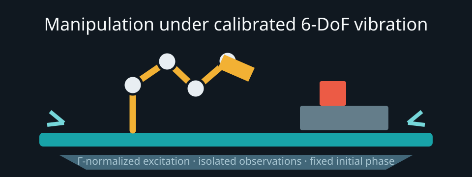

# ShakeBench

ShakeBench is an Isaac Lab + Newton/MJWarp benchmark for embodied manipulation while the robot base and worktable undergo calibrated six-axis vibration.



## Quick start

```python
import shakebench
env = shakebench.make("PickPlace", control_freq=5, use_camera_obs=False)
obs, info = env.reset(seed=17)
for _ in range(env.horizon):
    action = env.action_space.sample()
    obs, reward, terminated, truncated, info = env.step(action)
    if terminated or truncated:
        break
env.close()
```

Install Isaac Lab 3.0 and its Newton dependencies, set `ISAACLAB_ROOT`, then install this repository with `pip install -e .`. Use `./run_python.sh` and `./run_tests.sh` so commands run in the Isaac environment. See [installation](docs/installation.md) and the [quickstart](docs/quickstart.md).

## Suites

| Suite | Variation | Tasks |
|---|---|---:|
| `shakebench_ladder` | Γ = 0.15, 0.30, 0.50, 0.75, 0.95 | 20 |
| `shakebench_sweep` | frequency scale = 0.25, 0.5, 1, 2, 4 | 20 |
| `shakebench_bandwidth` | policy rate = 2, 5, 10, 20, 50, 200 Hz | 24 |
| `shakebench_predictability` | spectral bandwidth ratio = 0, 0.10, 0.40 | 12 |

Each task has 50 committed initial states containing object placement, seed, scalar vibration time offset `t0`, calibrated level, and realized Γ. See the [benchmark protocol](docs/benchmark_protocol.md).

## Leaderboard

Round 6 establishes the protocol but does not claim paper results.

| Policy | Privileged observations | Status |
|---|---|---|
| `scripted` | none | integration sentinel; score pending |
| `random` | none | lower-bound sentinel; score pending |

## Add a policy

```python
class MyPolicy:
    requires_privileged = ()
    def reset(self): pass
    def act(self, observation):
        return model(observation)

env = shakebench.make("PickPlace", controller_configs=
    shakebench.load_controller_config("OSC_POSE"))
```

The full observation/action contract is in [environments](docs/environments.md), with integration guidance in [policies](docs/policies.md).

## Documentation

- [Vibration model](docs/vibration_model.md)
- [Physics fidelity](docs/physics_fidelity.md)
- [Code structure](docs/code_structure.md)
- [Asset licenses](docs/asset_licenses.md)

## Citation and license

```bibtex
@software{shakebench2026,
  title = {ShakeBench: Manipulation under Multi-Axis Vibration},
  year = {2026},
  version = {0.2.0}
}
```

Code is released under the [MIT License](LICENSE). Third-party assets retain their own licenses; see [asset licenses](docs/asset_licenses.md).
